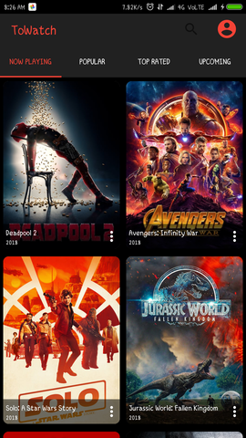
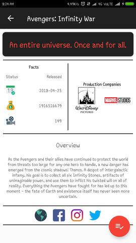

# ToWatch

## Project is Live

## The basic idea of the application : 
  Suppose you came across a cool movie trailer and you want to add it to your movie WatchLater list.
  Just share the video in this application and get the information of the movie.

From this app you can also search for movies, TV Shows

## Library used

Picasso : https://square.github.io/picasso/

## API's to be used 

YouTube Data API v3 : https://developers.google.com/youtube/v3/docs/videos/list

tmdb api 3 : https://developers.themoviedb.org/3

## Past Build(s)

   
  

## Current Status 
For more info press 'g' + 'b'

  
  

